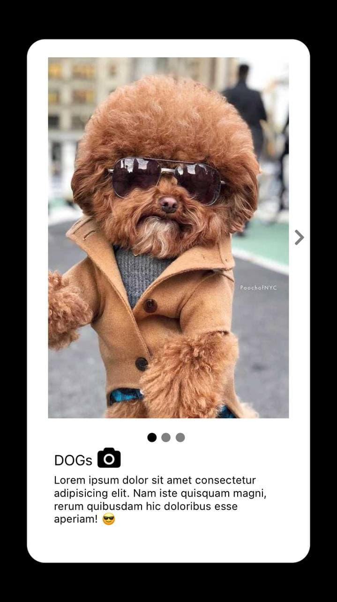

# Carousel App


In this project you will be navigate with next and previous botton to see three differents Blocks images. Have fun with these images of cool pets

## Start 🚀

_These instructions will allow you to get a copy of the project running on your local machine for development and testing purposes._


### Install 🔧

1. Clone the repo
   ```sh
   git clone https://github.com/cristianhd/carousel-app.git
   ```
2. Install all package (remember install api package)
   ```sh
   -npm install

   and them

   -cd api
   -npm install
   ```
3. Create the file .env and select port and IP you will be work

   ```sh
   mkdir .env

   example:
   API_PORT="3001"
   URL="http://10.0.2.2:3001"
   ```
3. Run the API

   ```sh
   cd api
   npm run dev
   ```
  
4. Run the App
   ```sh
   expo start
   ```

## Dependencies 🛠️
```
-typescript to type-check our components exposed properties.
-redux for state management.
-redux-persist as persistance layer.
-redux-thunk to dispatch asynchronous actions.
-styled-components to give style the app
```
## - Screen
###  - Home



## License 📄 

#### This project was created for educational purposes, it is not for profit - feel free to use it
---
⌨️ con ❤️ por [Cristian Hernandez](https://github.com/cristianhd) 😊
